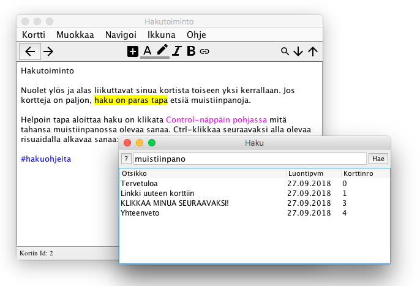

# Hypernote beast

Harjoitustyö TOL:n käyttöliittymäohjelmoinnin kurssille. Taustalla ihan oikea tarve muistiinpano-ohjelmalle, joka veisi mahdollisimman vähän ruututilaa ja jossa muistiinpanojen kokonaisuus rakentuisi linkkien avulla. Erittäin varhainen prototyyppi. Ei tallentele mitään. Ehkä joskus jatkan tästä, kun on aikaa.

## Asennus ja ohjelman ajaminen

Toimii eri alustoilla. Ulkoasua katsottu lähinnä Cinnamon-ympäristössä, joten Mac ja Windows -versioissa on vähän eri meininki.

    $ javac beast/Beast.java
	$ java beast.Beast

## Muuta

Ikoneina käytetty Googlen Material Design -ikoneita:
<https://github.com/google/material-design-icons>

